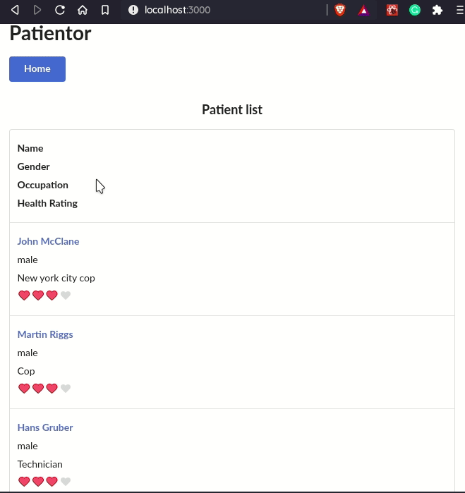

# Patientor
A nodeJs application meant to be a showcase of mainly backend tools like  Prisma, GraphQL and Nexus.

## Local development
Check each `README.md` folder for instructions about how to run each project in console mode.

## Production (locally)
You can serve the whole stack locally in production mode.

```console
$ docker-compose -f docker-compose-local.yml up
```

* You can edit the compose `environment` variables in the `docker-compose-local.yml` as you need.


